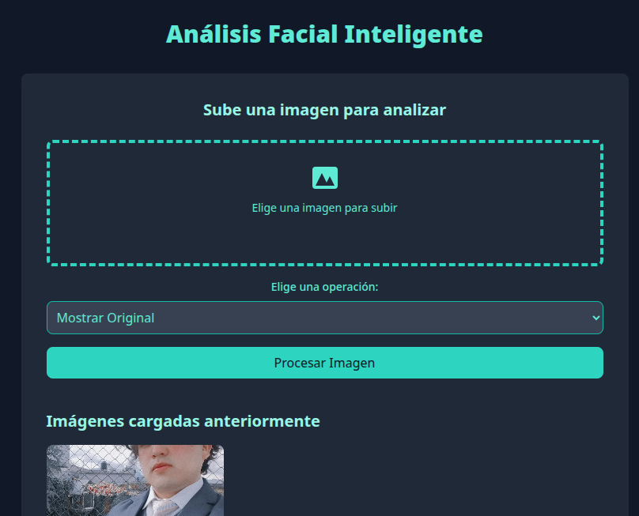
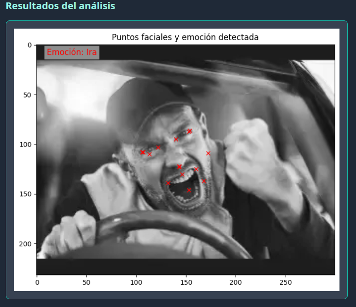

# 😊 API de Análisis de Emociones Faciales

[](https://python.org)
[](https://flask.palletsprojects.com/)
[](https://mediapipe.dev/)
[](https://opencv.org/)
[](#license)

> 🔒 **ADVERTENCIA DE PRIVACIDAD**: Este proyecto es exclusivamente para fines educativos y de investigación. Maneja imágenes y datos faciales en un entorno seguro y respeta las normativas de privacidad.

## 📋 Descripción

Una **API web desarrollada con Flask** que combina tecnologías de computer vision y machine learning para analizar expresiones faciales en tiempo real. El sistema utiliza **MediaPipe** para la detección de puntos faciales clave y algoritmos de clasificación para identificar emociones humanas.

### ✨ Características Principales

- 🎯 **Detección de Puntos Faciales**: 68 puntos de referencia usando MediaPipe
- 😄 **Clasificación de Emociones**: Detección de 5 emociones básicas
- 📤 **Carga de Imágenes**: Soporte para múltiples formatos de imagen
- 📊 **Visualización de Datos**: Análisis del dataset con gráficos interactivos
- 🌐 **API REST**: Endpoints simples y documentados
- 🔧 **Interfaz Web**: Dashboard intuitivo para interactuar con la API
- 🚀 **Exposición Pública**: Integración opcional con ngrok

### 🎭 Emociones Detectadas

| Emoción | Código | Descripción |
|---------|--------|-------------|
| 😡 Ira | 0 | Expresiones de enojo y molestia |
| 😢 Tristeza | 1 | Estados de melancolía y dolor |
| 😊 Felicidad | 2 | Expresiones de alegría y satisfacción |
| 😮 Sorpresa | 3 | Reacciones de asombro |
| 😠 Odio | 4 | Expresiones de disgusto intenso |

## 🖼️ Capturas del Proyecto

### Interfaz Principal

*Dashboard principal con opciones de carga y análisis de imágenes*

### Análisis de Emociones

*Resultado del análisis mostrando puntos faciales y emoción detectada*

## 🔧 Requisitos del Sistema

### Especificaciones Técnicas
- **Python**: 3.8 o superior
- **RAM**: Mínimo 4GB (8GB recomendado)
- **CPU**: Procesador de doble núcleo o superior
- **Almacenamiento**: ~2GB para dependencias y modelos
- **Cámara**: Opcional para análisis en tiempo real

### Entornos Recomendados
- 🐳 **Docker** (Recomendado)
- 🖥️ **Máquina Virtual** (VirtualBox, VMware)
- 🔒 **Entorno Aislado** sin acceso a datos sensibles

## 📦 Instalación

### Método 1: Instalación Estándar

```bash
# 1. Clonar el repositorio
git clone https://github.com/FERNANDOANGEL202123767/facial-emotion-api.git
cd facial-emotion-api

# 2. Crear entorno virtual
python -m venv venv

# 3. Activar entorno virtual
# Linux/macOS:
source venv/bin/activate
# Windows:
venv\Scripts\activate

# 4. Instalar dependencias
pip install -r requirements.txt

# 5. Verificar instalación
python -c "import cv2, mediapipe; print('✅ Instalación exitosa')"
```

### Método 2: Con Docker (Recomendado)

```dockerfile
# Dockerfile incluido en el proyecto
FROM python:3.9-slim

WORKDIR /app
COPY requirements.txt .
RUN pip install -r requirements.txt

COPY . .
EXPOSE 5001

CMD ["python", "app.py"]
```

```bash
# Construir y ejecutar contenedor
docker build -t facial-emotion-api .
docker run -p 5001:5001 facial-emotion-api
```

## 🚀 Uso de la Aplicación

### Iniciar el Servidor

```bash
# Método básico
python app.py

# Con configuración personalizada
export FLASK_ENV=development
export PORT=5001
python app.py
```

**Acceso Local**: http://localhost:5001

## 🔌 API Endpoints

### 1. Página Principal
```http
GET /
```
**Descripción**: Interfaz web principal  
**Respuesta**: Página HTML con formulario de carga

### 2. Análizar Imagen
```http
POST /analyze
Content-Type: multipart/form-data
```

**Parámetros**:
- `file`: Archivo de imagen (nueva)
- `existing_file`: Nombre de imagen existente

**Ejemplo con cURL**:
```bash
# Subir nueva imagen
curl -X POST -F "file=@mi_imagen.jpg" http://localhost:5001/analyze

# Usar imagen existente
curl -X POST -F "existing_file=imagen_guardada.jpg" http://localhost:5001/analyze
```


## 📊 Especificaciones Técnicas

### Formatos de Imagen Soportados
- **PNG** (Recomendado para calidad)
- **JPG/JPEG** (Optimizado para tamaño)
- **Tamaño máximo**: 16 MB por imagen
- **Resolución recomendada**: 640x480 a 1920x1080

### Rendimiento
- **Tiempo de procesamiento**: ~0.3-1.5 segundos por imagen
- **Precisión del modelo**: ~85-92% según el dataset
- **Memoria utilizada**: ~200-500 MB durante procesamiento


### Validación de Modelos
```bash
# Verificar precisión del modelo
python utils/validate_model.py --dataset data/icml_face_data.csv
```

## 🤝 Contribuciones

¡Las contribuciones son bienvenidas! Por favor sigue estos pasos:

### Proceso de Contribución

1. **Fork** el repositorio
2. **Crear rama** de funcionalidad:
   ```bash
   git checkout -b feature/nueva-funcionalidad
   ```
3. **Desarrollar** con tests incluidos
4. **Commit** con mensajes descriptivos:
   ```bash
   git commit -m "feat: agregar detección de micro-expresiones"
   ```
5. **Push** y crear **Pull Request**

### Áreas de Contribución
- 🧠 Mejoras en algoritmos de detección
- 🎨 Enhancements en la interfaz de usuario  
- 📊 Nuevos datasets y modelos
- 🔧 Optimizaciones de rendimiento
- 📚 Documentación y tutoriales

## 📄 Licencia

Este proyecto está bajo licencia **Educational Use Only**.

```
MIT License - Educational Use

Copyright (c) 2025 Fernando Angel

```

## 👨‍💻 Contacto y Soporte

**Desarrollador Principal**: Fernando Angel  
**GitHub**: [@FERNANDOANGEL202123767](https://github.com/FERNANDOANGEL202123767)  

### 🆘 Obtener Ayuda

1. **Issues**: [GitHub Issues](https://github.com/FERNANDOANGEL202123767/facial-emotion-api/issues)
2. **Discusiones**: [GitHub Discussions](https://github.com/FERNANDOANGEL202123767/facial-emotion-api/discussions)

### 📚 Recursos Adicionales

- [Documentación de MediaPipe](https://mediapipe.dev/)
- [Guía de OpenCV](https://opencv.org/documentation/)
- [Tutorial de Flask](https://flask.palletsprojects.com/tutorial/)
- [Curso de Computer Vision](https://www.coursera.org/learn/computer-vision-basics)

---


**🌟 Si este proyecto te fue útil, considera darle una estrella en GitHub 🌟**

**Construido con ❤️ para la investigación en Computer Vision y AI**

[⬆️ Volver al inicio](#-api-de-análisis-de-emociones-faciales)
